<p align="center"></p>

# Sentinel

[](LICENSE)
[](https://github.com/marcuspat/Sentinel/actions)

> ⭐ If Sentinel gives your AI agents a safety net, [a star helps others find it](https://github.com/marcuspat/Sentinel).

Sentinel is a safe, auditable agentic system administration tool written in Rust.
It drives an **Investigate → Plan → Approve → Act** workflow: the LLM gathers
read-only observations, proposes a structured plan, waits for explicit operator
approval, then executes under a strict deny-by-default policy engine with a
hash-chained audit log.

## 🎬 Demo


*The capability catalog and the deny-by-default policy engine — no API key needed for either. Recorded from the actual binary with [asciinema](https://asciinema.org) + [agg](https://github.com/asciinema/agg).*

## Features

- **Deny-by-default policy engine** — kill switch, resource guards, risk-tiered rules,
  and operator policy files that can only tighten the built-in policy unless told otherwise
- **Operator approval gate** — no mutating action runs without explicit approval
- **One plan executor** — `run`, the TUI and `execute` share it: policy re-checked per
  step, halt on first failure, completed steps rolled back in reverse order
- **Sandboxed execution** — exact-match allowlist, no shell, empty environment,
  `no_new_privs`, Landlock write confinement per capability, seccomp network denial
- **Hash-chained audit log** — SHA-256 chain, optional Ed25519-signed checkpoints,
  JSONL export, tamper detection
- **MCP policy gate** — coding agents can ask and propose; only an operator can approve
  and execute
- **14 built-in capabilities** — filesystem, process, services, packages, network, metrics
- **LLM backends** — Anthropic and OpenAI from the CLI, with provider-native tool use,
  retries, per-attempt deadlines and per-session call/token budgets. An Ollama backend
  exists in `sentinel-agent-llm` but is not yet selectable from the CLI
- **Prompt-injection defence** — capability output reaches the model inside a
  random-nonce fence marked as untrusted data; policy and approval still bound what a
  fooled model can do
- **Fleet mode** — one capability across many hosts over SSH, with policy checked on the
  controller and again on each host
- **Observability** — Prometheus text metrics derived from the audit stream, GenAI spans
- **Interactive TUI** — ratatui 0.30, six tabs, full keyboard navigation

## Install

Build from source — `sentinel` isn't published to crates.io (the crate name is already taken by an unrelated project):

```bash
git clone https://github.com/marcuspat/Sentinel
cd Sentinel
cargo build --release
# binary at target/release/sentinel
```

## Quick Start

```bash
# Interactive TUI (default)
sentinel

# With a goal on the command line
sentinel run "Ensure nginx is running and serving traffic"

# Target a specific host
sentinel tui --host web-01.prod

# With Anthropic backend (the default)
ANTHROPIC_API_KEY=sk-... sentinel run "Fix high disk usage on /var"

# With OpenAI
OPENAI_API_KEY=sk-... sentinel --backend openai --model MODEL run "Check CPU load"

# With an operator policy file on top of the built-in policy
sentinel --policy /etc/sentinel/policy.toml run "Restart the stuck worker"
```

## Build

```bash
# Requires Rust 1.86+ (ratatui 0.30 and clap 4.6 set the floor)
cargo build --release

# Run all tests
cargo test --workspace

# Static analysis
cargo clippy --workspace --all-targets -- -D warnings

# Dependency advisories, licences and sources (what CI runs)
cargo deny check
```

CI builds and tests with a pinned toolchain (1.97.0); see
[docs/SUPPLY_CHAIN.md](docs/SUPPLY_CHAIN.md).

### Static musl binary (for container / bare-metal deployment)

```bash
rustup target add x86_64-unknown-linux-musl
cargo build --release --target x86_64-unknown-linux-musl
```

## CLI Reference

| Command | Description |
|---|---|
| `sentinel` | Launch interactive TUI (default) |
| `sentinel tui [--host HOST]` | Launch TUI targeting HOST |
| `sentinel run GOAL [--host HOST] [--dry-run] [--auto-approve]` | Non-interactive run; prompts for approval unless `--auto-approve` |
| `sentinel capabilities` | List all built-in capabilities |
| `sentinel policy` | Show the effective policy: rules, tightening rules from `--policy FILE`, resource guards |
| `sentinel verify-audit PATH [--pubkey HEX\|FILE] [--require-signature]` | Verify audit log chain integrity, and its signed checkpoints when a public key is given |
| `sentinel audit-keygen --out FILE` | Generate an Ed25519 audit-signing key; set `SENTINEL_AUDIT_KEY=FILE` to sign every audit log |
| `sentinel serve --mcp [--state-dir DIR] [--host HOST]` | Run as an MCP policy gate for coding agents (stdio) |
| `sentinel plans` / `sentinel show-plan ID` | List / inspect plans proposed through the gate |
| `sentinel approve ID` | Operator approval of a proposed plan (interactive terminal required) |
| `sentinel reject ID [--reason TEXT]` | Reject a proposed plan |
| `sentinel execute ID [--step-timeout-ms N]` | Execute an approved plan; refuses unapproved or modified plans |
| `sentinel fleet GOAL --hosts A,B [--capability ID] [--args JSON] [--approve]` | Run one capability on many hosts over SSH; each host re-checks under its own policy |

Global options: `--policy FILE`, `--no-rollback`, `--backend anthropic|openai`,
`--model`, `--log-level`.

| Environment variable | Effect |
|---|---|
| `ANTHROPIC_API_KEY` / `OPENAI_API_KEY` | Credentials for the chosen backend |
| `SENTINEL_POLICY` | Policy file, same as `--policy` |
| `SENTINEL_STATE_DIR` | Plan store and audit log directory for the gate commands |
| `SENTINEL_AUDIT_KEY` / `SENTINEL_AUDIT_PUBKEY` | Sign audit logs / verify them |
| `SENTINEL_LANDLOCK=off\|require` | Disable Landlock, or fail closed when the kernel lacks it (default: warn and continue) |
| `SENTINEL_NO_ROLLBACK` | Same as `--no-rollback` |
| `SENTINEL_MAX_LLM_CALLS` / `SENTINEL_MAX_LLM_TOKENS` | Per-session budget (defaults 100 calls, 2,000,000 tokens) |
| `SENTINEL_NATIVE_TOOLS=off` | Fall back to text-parsed capability requests |
| `SENTINEL_METRICS_FILE` | Write Prometheus text metrics to this file (for node_exporter's textfile collector) |

## Policy files

`--policy FILE` loads operator rules (TOML) on top of the built-in policy:

```toml
version = 1
# mode = "tighten"   # default; "replace" swaps out the built-in rules

[[rule]]
id = "no-restarts-on-prod"
description = "Production services are restarted by the on-call human"
effect = "deny"            # deny | require_approval | audit_only | allow
priority = 10
[rule.when]
capability_id_in = ["service_restart", "service_stop"]
target_host = "prod-*"

[[guard]]
id = "app-data"
protected_paths = ["/srv/app/data"]
protected_services = ["postgresql"]
```

In `tighten` mode a file can only make a decision stricter; `allow` is rejected
at load time. `replace` is the only way to loosen policy. In both modes the kill
switch and built-in resource guards stay in force, and a file that fails to
parse stops the command. `sentinel policy` prints the effective result. See
[ADR-018](docs/adr/ADR-018-policy-files.md).

## Policy gate for coding agents (MCP)

`sentinel serve --mcp` exposes Sentinel's capability catalogue, deny-by-default
policy engine and hash-chained audit log to any MCP client (Claude Code,
Cursor, …) over stdio. The agent can **ask** and **propose**; it cannot
**approve** or **execute**:

| Tool | What it does | Touches the host? |
|---|---|---|
| `sentinel_capabilities` | List capabilities with kind and risk tier | No |
| `sentinel_policy_check` | Dry-run a policy decision; returns allow/deny/require_approval + matching rule | No |
| `sentinel_investigate` | Run one **read-only** capability after a policy check | Read-only |
| `sentinel_propose_plan` | Validate + store a plan as `PendingApproval`, return `plan_id` | Writes the plan store only |
| `sentinel_plan_status` | Read a stored plan's status | No |

There is no approve or execute tool. An operator reviews the plan and runs
`sentinel approve <plan_id>` (interactive terminal required) and then
`sentinel execute <plan_id>`, or uses the TUI's Gate tab. Execution
re-evaluates policy per step, refuses any plan whose content changed after
approval, and claims the plan under a lock so it cannot run twice. Every MCP call, policy
decision, approval and capability invocation is written to a per-process
hash-chained JSONL log under `<state-dir>/audit/`, verifiable with
`sentinel verify-audit`.

Claude Code — project `.mcp.json`:

```json
{
  "mcpServers": {
    "sentinel": {
      "type": "stdio",
      "command": "sentinel",
      "args": ["serve", "--mcp"],
      "env": { "SENTINEL_STATE_DIR": "/var/lib/sentinel" }
    }
  }
}
```

If the agent also has a shell, deny it the operator commands in
`.claude/settings.json` as defence in depth:

```json
{
  "permissions": {
    "deny": ["Bash(sentinel approve:*)", "Bash(sentinel execute:*)"]
  }
}
```

The TTY check on `approve` and these deny rules are speed bumps, not a
security boundary: a process running as the same OS user can allocate a
pseudo-terminal or edit the state directory. For a hard boundary, run the gate
and own the state directory as a separate user. See
[ADR-013](docs/adr/ADR-013-mcp-policy-gate.md) for the threat model and
[plans/SPEC-mcp-gate-and-arena.md](plans/SPEC-mcp-gate-and-arena.md) for the
roadmap.

## Architecture

```
sentinel-core          — Capability trait, RiskTier, CapabilityResult, Plan types
sentinel-exec          — Hardened command executor (allowlist, timeout, rlimits, Landlock, seccomp)
sentinel-policy        — PolicyEvaluator: kill switch -> resource guards -> rules; policy files
sentinel-audit         — SHA-256 hash-chained audit log, signed checkpoints, JSONL, Prometheus metrics
sentinel-capabilities  — 14 concrete capabilities (fs, process, services, packages, net, metrics)
sentinel-agent-llm     — Investigate/Plan/Act reasoning loop, LLM backends, native tool use, retries and budgets
sentinel-runner        — The one plan executor: per-step policy, halt on failure, rollback
sentinel-fleet         — SSH fleet dispatch; staged-rollout and mTLS code not yet wired to the CLI
sentinel-tui           — ratatui TUI: 6 tabs (incl. Gate for MCP plans), approval workflow, clap CLI
sentinel-mcp           — MCP stdio policy gate: tools, locked plan store
```

## Security Model

- **Kill switch** — blocks all capabilities (ReadOnly and Mutating) when activated
- **Resource guards** — protect system directories (/etc, /boot, /sys, /proc, /dev, /bin,
  /usr/bin, /lib, …) and critical services (sshd, systemd, docker, containerd), whatever
  the argument is called and however the path or unit is spelled
- **Command allowlist** — exact-match only; basename fallback is intentionally absent
- **Sandbox** — empty child environment, `no_new_privs`, Landlock write confinement,
  seccomp network denial for everything but the package managers
- **Untrusted output** — capability output reaches the model inside a random-nonce fence
  that the output itself cannot close or forge
- **PID guard** — ProcessKill rejects PID <= 1 (init/systemd is protected)
- **Signal allowlist** — only TERM/KILL/HUP/INT/QUIT/USR1/USR2/CONT/STOP accepted
- **Path validation** — destructive capabilities reject system directories
- **Time restrictions** — evaluated against server wall-clock, not client timestamp
- **Signed audit** — optional Ed25519 checkpoints detect a log rewritten wholesale
- **Fleet** — runs over SSH; policy is evaluated on the controller and again on each host.
  The mTLS controller protocol of ADR-008 is not implemented

[SECURITY.md](SECURITY.md) has the full model and its known limitations.

See [docs/adr/](docs/adr/README.md) for the Architecture Decision Records and
[docs/ddd/](docs/ddd/) for Domain-Driven Design documentation.

## Sentinel vs. Ansible / plain SSH

Ansible and hand-rolled SSH scripts run what you tell them to, without judgment. Sentinel's LLM proposes the fix from a live investigation, but nothing mutates until an operator approves it — every action still passes through the same deny-by-default policy engine, resource guards, and hash-chained audit log regardless of who or what proposed it. Reach for Ansible/SSH when the fix is a known, repeatable playbook; reach for Sentinel when the fix isn't known ahead of time and you want a verifiable record of exactly what an agent was allowed to do about it.

## Ecosystem

| Repo | What it does |
|------|-------------|
| [**codescope**](https://github.com/adventurewave-labs/codescope) | Rust code-intelligence engine for AI agents — no cloud, no DB |
| [**secret-scan**](https://github.com/adventurewave-labs/secret-scan) | Rust secret scanner — obfuscation detection |
| [**turbo-flow**](https://github.com/marcuspat/turbo-flow) | Agentic dev environment — Ruflo v3.5 orchestration (by [ruvnet](https://github.com/ruvnet)), 215+ MCP tools |

## License

MIT — see [LICENSE](LICENSE).
